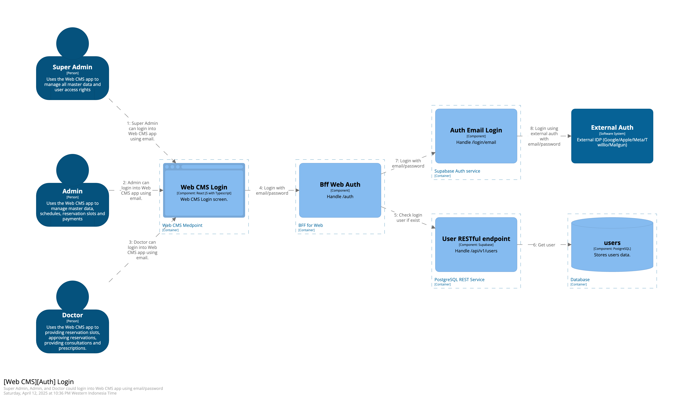

### Prerequesites
- Make sure docker is installed in your machine https://www.docker.com

### How to run

1. Clone this repo
2. Run `make run` in terminal
3. Navigate to localhost:8086 for the C4 diagram

# C4 Diagram
## Context (C1)

## Container (C2)

## User story
### Mobile App
1. [Mobile][Auth] Login and Register
   
2. [Mobile][Manage Profile] Profile
   User patient can manage data profile
   
3. [Mobile][Services] Search and see list health services
   Show list health services
   
4. [Mobile][Reservation] Reservation
   
5. [Mobile][Payment] Payment
   

### Web CMS
1. [Web CMS][Auth] Login
   
2. [Web CMS][User Management] User Management
   
3. [Web CMS][Data Doctor] Data Doctor
   
4. [Web CMS][Data Master] Faskes
   
5. [Web CMS][Data Master] Poli
   
6. [Web CMS][Data Master] Services
   
7. [Web CMS][Data Master] Address
   
8. [Web CMS][Reservation] Reservation
   
9. [Web CMS][Payment] Payment
   

## Code Diagram (C4)
1. [Login]
   
2. [Reservation]
   
