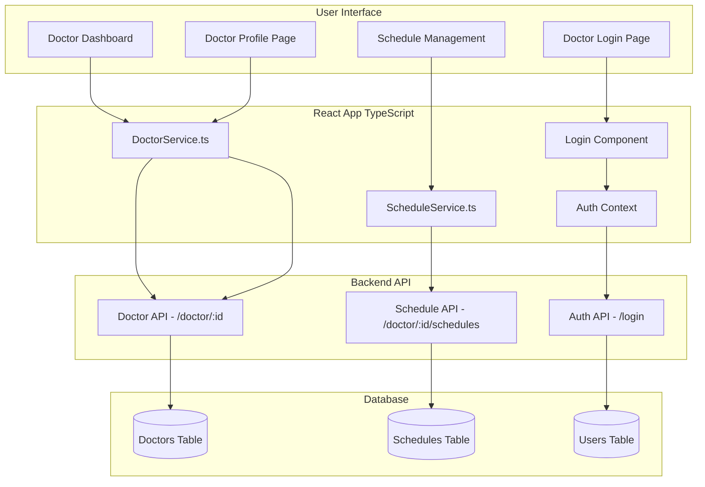

```mermaid
graph TD
  subgraph User Interface
    A1[Doctor Login Page]
    A2[Doctor Dashboard]
    A3[Doctor Profile Page]
    A4[Schedule Management]
  end

  subgraph React App TypeScript
    B1[Login Component]
    B2[Auth Context]
    B3[DoctorService.ts]
    B4[ScheduleService.ts]
  end

  subgraph Backend API
    C1[Auth API - /login]
    C2[Doctor API - /doctor/:id]
    C3[Schedule API - /doctor/:id/schedules]
  end

  subgraph Database
    D1[(Doctors Table)]
    D2[(Schedules Table)]
    D3[(Users Table)]
  end

  %% Flow
  A1 --> B1
  B1 --> B2
  B2 --> C1
  C1 --> D3

  A2 --> B3
  B3 --> C2
  C2 --> D1

  A4 --> B4
  B4 --> C3
  C3 --> D2

  A3 --> B3
  B3 --> C2
```