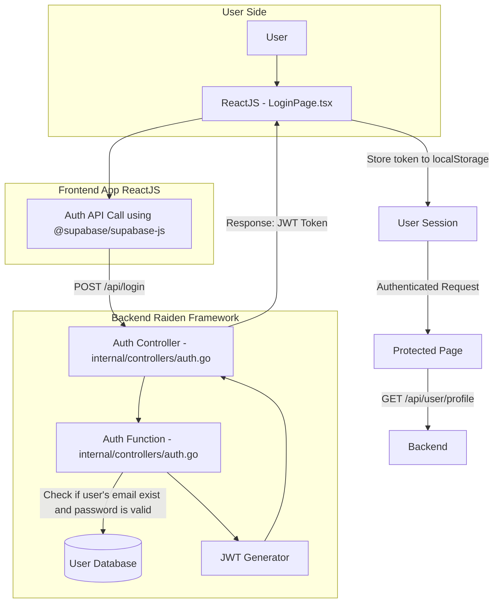

```mermaid
    graph TD
    subgraph User Side
        User[User]
        LoginPage[ReactJS - LoginPage.tsx]
    end

    subgraph Frontend App ReactJS
        User --> LoginPage
        LoginPage --> AuthAPI[Auth API Call using @supabase/supabase-js]
    end
    
    subgraph Backend Raiden Framework
        AuthAPI -->|POST /api/login| AuthController[Auth Controller - internal/controllers/auth.go]
        AuthController --> AuthFunction[Auth Function - internal/controllers/auth.go]
        AuthFunction --> |Check if user's email exist and password is valid| UserDB[(User Database)]
        AuthFunction --> TokenService[JWT Generator]
        TokenService --> AuthController
    end
    
    AuthController -->|Response: JWT Token| LoginPage
    LoginPage -->|Store token to localStorage| UserSession[User Session]
    
    UserSession -->|Authenticated Request| ProtectedPage[Protected Page]
    ProtectedPage -->|GET /api/user/profile| Backend
```