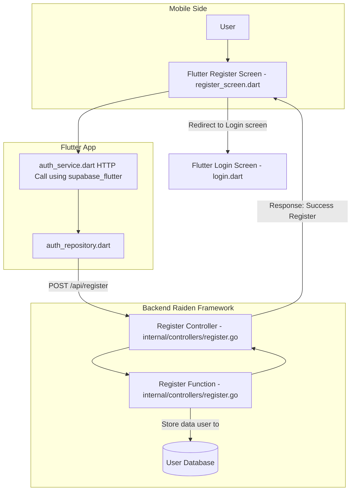

```mermaid
graph TD
    subgraph Mobile Side
        User[User]
        RegisterScreen[Flutter Register Screen - register_screen.dart]
    end

    subgraph Flutter App
        User --> RegisterScreen
        RegisterScreen --> AuthService[auth_service.dart HTTP Call using supabase_flutter]
        AuthService --> AuthRepository[auth_repository.dart]
    end

    subgraph Backend Raiden Framework
        AuthRepository -->|POST /api/register| RegisterController[Register Controller - internal/controllers/register.go]
        RegisterController --> RegisterFunction[Register Function - internal/controllers/register.go]
        RegisterFunction -->|Store data user to| UserDB[(User Database)]
        RegisterFunction --> RegisterController
    end

    RegisterController -->|Response: Success Register| RegisterScreen
    RegisterScreen -->|Redirect to Login screen| UserSession[Flutter Login Screen - login.dart]
```