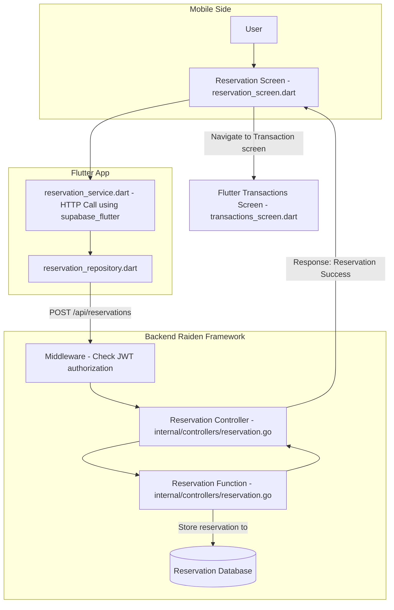

```mermaid
graph TD
    subgraph Mobile Side
        User[User]
        ReservationScreen[Reservation Screen - reservation_screen.dart]
    end

    subgraph Flutter App
        User --> ReservationScreen
        ReservationScreen --> ReservationService[reservation_service.dart - HTTP Call using supabase_flutter]
        ReservationService --> ReservationRepository[reservation_repository.dart]
    end

    subgraph Backend Raiden Framework
        ReservationRepository -->|POST /api/reservations| ReservationMiddleware[Middleware - Check JWT authorization]
        ReservationMiddleware --> ReservationController[Reservation Controller - internal/controllers/reservation.go]
        ReservationController --> ReservationFunction[Reservation Function - internal/controllers/reservation.go]
        ReservationFunction -->|Store reservation to| ReservationDB[(Reservation Database)]
        ReservationFunction --> ReservationController
    end

    ReservationController -->|Response: Reservation Success| ReservationScreen
    ReservationScreen -->|Navigate to Transaction screen| TransactionsScreen[Flutter Transactions Screen - transactions_screen.dart]
```